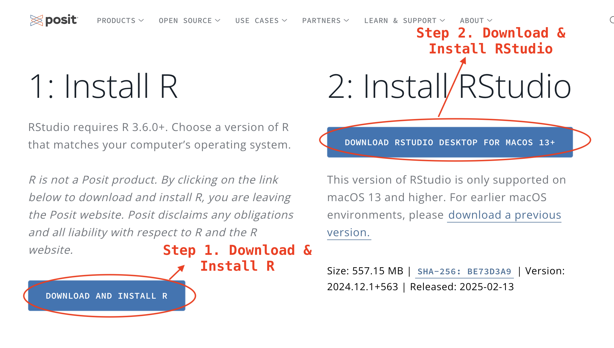
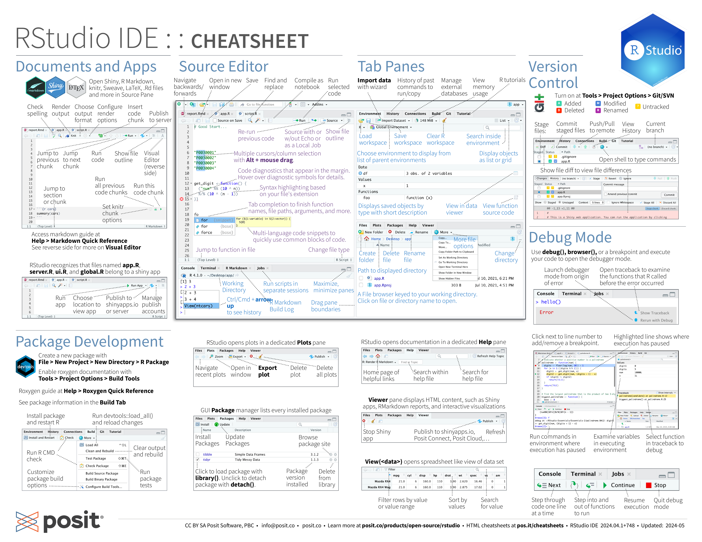

::: {.callout-note title="Part 1: Getting Started"}
This chapter introduces the tools we will use throughout the book. You will
install R and RStudio, create one R Project for the lessons, install the
tidyverse, and make your first R Markdown document.
:::

## Learning objectives

By the end of this chapter, you should be able to:

- explain the difference between R and RStudio;
- explain why an R Project keeps an analysis organized and reproducible;
- distinguish installing a package from loading it;
- explain the relationship between Markdown and R Markdown; and
- create and knit a simple R Markdown document.

## R

**R is a programming language for working with data.** We can use it to read
data, clean tables, calculate statistics, and create charts. The instructions
we write in R are called **code**.

R is also the engine that runs that code. When we ask R to calculate `2 + 2`,
R does the calculation and returns the result. Later, the same engine will run
longer sequences of instructions that produce a table or chart.

R is useful for data journalism because the code keeps a record of the steps
between a source file and a finding. Those steps can be rerun when the data are
updated, checked by an editor, or shared with another reporter. R is free and
open source, and it runs on Windows, macOS, and Linux.

Download R from the [Comprehensive R Archive Network (CRAN)](https://cran.r-project.org/).
CRAN is the official network that distributes R and thousands of contributed
packages. Select your operating system, download the current release, and use
the standard installation options.

::: {.callout-tip title="Learn more about R"}
The R Project's official [What is R?](https://www.r-project.org/about.html)
page gives a broader introduction. The [CRAN website](https://cran.r-project.org/)
contains downloads, manuals, and other R resources.
:::

## RStudio

**RStudio is a program that makes it easier to work with R.** More precisely,
it is an **integrated development environment**, often shortened to **IDE**.
An IDE brings the tools for writing code, running it, viewing results, and
organizing files into one screen.

R and RStudio are related, but they are not the same thing:

| Tool | Main job |
|---|---|
| R | Understands and runs R code |
| RStudio | Provides a convenient place to write the code and work with the results |

One way to remember the relationship is that **R is the engine and RStudio is
the workspace around the engine**. RStudio needs R to be installed, which is
why R must be installed first.

After installing R, download
[RStudio Desktop](https://posit.co/download/rstudio-desktop/) and use the
standard installation options.



::: {.callout-important title="Installation order matters"}
Install R first and RStudio second. Opening RStudio does not replace R;
RStudio uses the installed R engine to run your code.
:::

### The RStudio screen

RStudio normally displays four areas called **panes**:

| Position | Pane | What happens there |
|---|---|---|
| Top left | Source | Write and save R Markdown documents and other code files |
| Bottom left | Console | Run short R commands and see immediate results |
| Top right | Environment | See the data and other objects created during the current session |
| Bottom right | Files, Plots, Packages, Help | Find files, view charts, manage packages, and open help pages |

The **Source pane** holds work that you save. The **Console** is useful for a
quick experiment, but commands typed only there are easy to lose. For the
lessons in this book, write important code in an R Markdown document.



::: {.callout-tip title="Learn more about RStudio"}
Posit provides an official [RStudio getting-started guide](https://docs.posit.co/ide/user/ide/get-started/)
and a more detailed [RStudio IDE user guide](https://docs.posit.co/ide/user/).
You can also download the course's
[RStudio IDE cheatsheet](cheatsheets/rstudio-ide.pdf).
:::

## R Project

An **R Project** is a folder that keeps the files for one piece of work
together. RStudio calls it an **RStudio Project** and adds a small file ending
in `.Rproj` to the folder.

Opening the `.Rproj` file tells RStudio which project you are working on. It
also makes the project folder the **working directory**: the starting place R
uses when it looks for a file. This allows us to use a short path such as
`data/news.csv` instead of a path tied to one person's Desktop.

Projects are helpful because they keep these materials together:

- the original data;
- R Markdown documents containing the analysis;
- tables and charts created by the analysis; and
- notes about the source and reporting decisions.

We will create one project and continue using it throughout the book:

1. Choose **File → New Project → New Directory → New Project**.
2. Enter `djr` as the directory name.
3. Choose where to save it and click **Create Project**.
4. In the Files pane, click **New Folder** and create `data`.
5. Create another folder named `outputs`.

The project should begin like this:

```text
djr/
├── data/
├── outputs/
└── djr.Rproj
```

Open `djr.Rproj` whenever you return to the lessons. Do not create
a new project for every chapter; create a new R Markdown document inside this
same project.

::: {.callout-tip title="Learn more about R Projects"}
The official [RStudio Projects guide](https://docs.posit.co/ide/user/ide/guide/code/projects.html)
explains how projects manage files, working directories, and separate R
sessions. The simple project above is all you need to begin this book.
:::

## Packages

R includes many useful tools, but it does not include every task someone might
need. An **R package** is a collection of reusable functions, documentation,
and sometimes example data. A **function** is a named instruction that performs
a task. For example, a function might import a CSV file or draw a chart.

There are two separate actions to remember:

| Action | When it is needed | Example |
|---|---|---|
| Install a package | Usually once on a computer | `install.packages("tidyverse")` |
| Load a package | At the start of a new R session or document | `library(tidyverse)` |

Think of installation as putting a book on your shelf. Loading is taking that
book from the shelf so you can use it during the current session.

### The tidyverse

The **tidyverse** is a collection of R packages designed to work together. The
packages use consistent ideas and data structures, so learning one makes the
others easier to use. Important packages in this book include:

| Package | What we use it for |
|---|---|
| readr | Import CSV files |
| dplyr | Select, filter, sort, and summarise data |
| tidyr | Reshape data |
| ggplot2 | Create charts |
| tibble | Work with tidyverse data tables |
| stringr | Work with text |
| forcats | Work with categories |
| lubridate | Parse and work with dates and times |

Install the tidyverse and R Markdown package in the **Console**:

```r
install.packages("tidyverse")
install.packages("rmarkdown")
```

The tidyverse provides the tools for working with data. The **rmarkdown**
package allows RStudio to run an `.Rmd` file and turn its writing, code, and
results into a finished document such as an HTML page. We install it now
because every lesson in the main pathway uses R Markdown.

Quotation marks are needed because the package name is text. Installation can
take several minutes and may display many messages. You normally do not need
to install these packages again for every chapter.

::: {.callout-warning title="Do not install packages inside the document"}
Run `install.packages()` in the Console. Put `library(tidyverse)` inside the
R Markdown document so the document records which tools it needs.
:::

::: {.callout-tip title="Learn more about packages and the tidyverse"}
Start with the official [tidyverse overview](https://tidyverse.tidyverse.org/)
and the free book [R for Data Science](https://r4ds.hadley.nz/). Individual
package websites provide examples and full function references for
[readr](https://readr.tidyverse.org/),
[dplyr](https://dplyr.tidyverse.org/),
[tidyr](https://tidyr.tidyverse.org/),
[ggplot2](https://ggplot2.tidyverse.org/), and
[lubridate](https://lubridate.tidyverse.org/).
:::

## R Markdown

**Markdown** is a simple way to add formatting to plain text. Instead of using
toolbar buttons, you type small marks that describe the structure. For example:

| What you want | What you type |
|---|---|
| A heading | `# My heading` |
| Bold text | `**important finding**` |
| A bullet point | `- first item` |
| A link | `[R Project](https://www.r-project.org/)` |
| Inline code | `` `read_csv()` `` |

**R Markdown** combines Markdown writing with executable R code in one file.
An R Markdown filename ends in `.Rmd`. It can contain three kinds of material:

1. **Metadata** describing the document, such as its title and author.
2. **Narrative text** written with Markdown.
3. **Code chunks** containing R code and the results produced by that code.

This combination is useful in journalism because an explanation, the code
behind it, and the resulting table or chart stay together.

### Create the document

Inside `djr`, choose **File → New File → R Markdown**. Enter a
title and your name, select HTML output, and save the file as `00-setup.Rmd`
beside `djr.Rproj`.

The top of the new document contains **YAML metadata** between two lines of
three dashes. YAML is a simple `name: value` format for document settings:

```yaml
---
title: "Data Journalism W1"
author: "Your name"
output: html_document
---
```

For now, edit the title and author but leave `output: html_document` unchanged.

### Add text and a code chunk

Below the YAML, write a short introduction using ordinary text and Markdown.
Then add a code chunk with **Ctrl + Alt + I** on Windows or
**Cmd + Option + I** on Mac. RStudio creates the chunk markers for you. Put
these two lines inside the chunk:

```{r}
library(tidyverse)
2 + 2
```

`library(tidyverse)` loads the tidyverse packages for the current session. The
second line asks R to perform a calculation.

Click the green arrow on the chunk to run it. The result appears beneath the
code. Running one chunk is useful while learning or checking a step.

### Knit the document

Click **Knit** to run the entire R Markdown document from top to bottom and
create an HTML file. The HTML file is the finished output; the `.Rmd` file is
the editable source containing your writing and code.

Restart R with **Session → Restart R**, then click **Knit** again. If the HTML
file is created, the document contains the instructions it needs and your
setup is working.

::: {.callout-tip title="Learn more about Markdown and R Markdown"}
Use the official [R Markdown introduction](https://rmarkdown.rstudio.com/articles_intro.html),
[Markdown basics lesson](https://rmarkdown.rstudio.com/lesson-8.html), and
[R Markdown documentation](https://rmarkdown.rstudio.com/docs/) when you want
more detail. The course also includes an
[R Markdown cheatsheet](cheatsheets/rmarkdown.pdf).
:::

## Practice

Complete these steps in `00-setup.Rmd`:

1. Add your name and a title to the YAML metadata.
2. Write a heading called “About me.”
3. Write a short biography of about 50 words.
4. Make one important phrase bold.
5. Add a link to a news organization or publication you read.
6. Add a code chunk containing `library(tidyverse)` and `2 + 2`.
7. Run the chunk, restart R, and knit the complete document to HTML.

## Common setup problems

| What you see | What it usually means | What to check |
|---|---|---|
| `there is no package called ...` | The package is not installed | Run `install.packages()` in the Console |
| `could not find function ...` | The package is not loaded | Put `library(tidyverse)` near the top of the document |
| Knit fails but a chunk worked | The Console contains something the document did not create | Restart R and knit from the top |
| R cannot find a file | The wrong project is open or the path is incorrect | Open `djr.Rproj` and check the Files pane |

## Takeaways

| Term or command | What it means or does |
|---|---|
| R | The language and engine that runs the data analysis |
| RStudio | The IDE where we write code, manage files, and view results |
| R Project | Keeps the files for one piece of work together and gives R a reliable starting folder |
| Package | A collection of functions, documentation, and sometimes data |
| `install.packages()` | Installs a package on the computer, usually once |
| `library(tidyverse)` | Loads the core tidyverse packages for the current session |
| Markdown | Plain text with simple marks for headings, links, lists, and other formatting |
| R Markdown | A `.Rmd` document combining Markdown, R code, and results |
| Code chunk | A section of an R Markdown document that contains executable code |
| **Knit** | Runs the document and creates an output such as HTML |

In the next chapter, we will learn how to read and write the small pieces of R
code used throughout the book.
